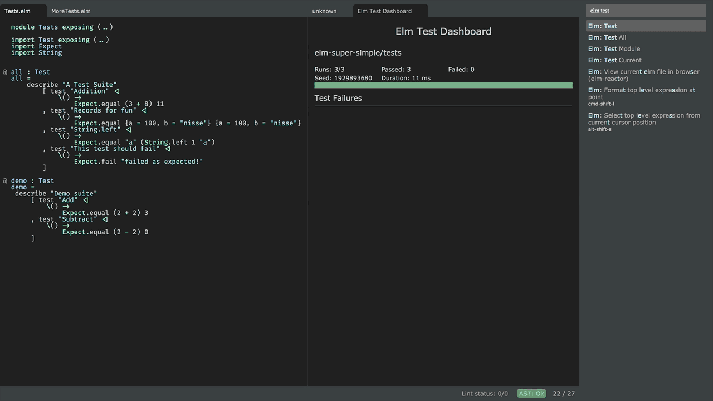
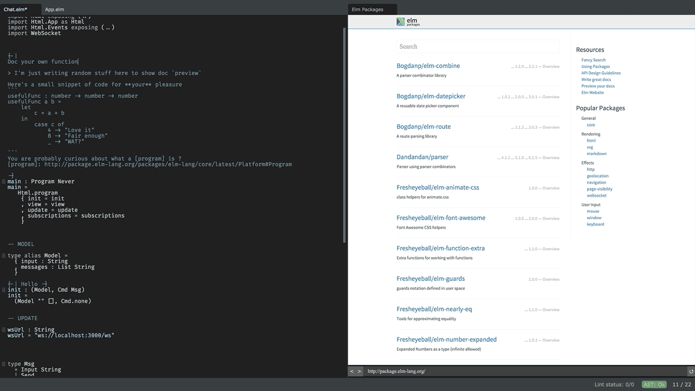

= Elm LightTable plugin

ifdef::env-github[]
:tip-caption: :bulb:
:note-caption: :information_source:
:important-caption: :heavy_exclamation_mark:
:caution-caption: :fire:
:warning-caption: :warning:
endif::[]

http://elm-lang.org/[Elm] language plugin for Light Table

image:images/elm-light.png[]

== Installation
Install using the Light Table plugin manager.
Alternatively you can clone it into `$LT_USER_HOME\plugins`. (If you know what you are doing,
this is a great way to try out the latest and greatests not yet released !)

== Preconditions
* **LIghtTable 0.8-alpha or higher is required**
* You will need to have the http://elm-lang.org/install[elm-platform] (there is also a npm installer out there)  installed and the following should be in your path:
** https://github.com/elm-lang/elm-reactor[elm-reactor]
** https://github.com/elm-lang/elm-make[elm-make]
** https://github.com/elm-lang/elm-package[elm-package]
** https://github.com/elm-lang/elm-repl[elm-repl]
* For all commands/features you will need to have a project folder with a `elm-package.json` file

NOTE: Tested with Elm 0.18.0 and Elm 0.17.1 on OS/X 10.9.5, Ubuntu 14.04 and Windows 10.

== Documentation
Please see the https://rundis.gitbooks.io/elm-light-guide/content/[Guide] for a comprehensive documentaiton
on how to use the plugin.

== Resources
* http://rundis.github.io/blog/2015/elm_light.html[ScreenCast] - Demo of the features available in the first release of the plugin
* http://elm-lang.org/[elm-lang.org] - The home of Elm
* https://github.com/LightTable/LightTable[Light Table] - Light Table on GitHub

== Feature demos

=== Testing

=== Inline docs and jump to

==== Type aliases and records even
image:images/elm-light_type_alias.gif[]

=== Package Manager

==== Install package and start using at once
image:images/pck_inst_and_use.gif[]

=== Module graph
image:images/module-graph.gif[]

== Contributing
Pull requests are most welcome. Please do not include the transpiled files (*_compiled*) in the PR.

== History
* 0.5.0 Elm Test support is back (requires Elm 0.18).
** Features to set up new test project, run one, a modules or all tests in your project. Test results display in a visual test runner + in the console.
** Show popup if the plugin isn't able to find the elm binaries
** Show errors when there is a mismatch between your project version and the currently install Elm version on your machine
** Show popup if you try to use elm-format related features, but the plugin is unable to find the elm-format executable
** Attempted to provide better support for node installed Elm executables on Windows (using cross-spawn)
** Fixed a regression with the interactive repl features not working
** Adjusted the autocompleter for changes in default imports in Elm 0.18
* 0.4.2
** Fixed a bug with faulty/erronous events from chokidar or it's underlying libs causing issues on Windows
* 0.4.1
** Fixed manual connect bug
** Auto completions for type alias params in function bodies
** Jump to and docs for type alias params in function bodies
* 0.4.0 Introduction of AST based features. The plugin now parses your project Elm files (and 3rd party packages too)
** Added features
*** Find usages
*** Inline doc now renders the documentation markdown (your own docs included)
*** You can Jump to definition and back
*** Autocompleter suggests both for 3rd party imports as well as for you project imports
*** Expose/unexpose declarations for a module
*** Quick import module
*** Sort imports
** Removed features
*** Elm test related features have temporarily been removed. They will be rewritten to support the totally rewritten elm-test package
*** Elm reactor debug command has been removed as elm-reactor doesn't support debugging in 0.17

* 0.3.8 Support code folding, fix autoclose brackets issue, scrollposition after format improvement
* 0.3.7 Improved autocompleter implementation and added quick-fixes feature to Linter messages
* 0.3.6 Added package doc preview feature
** Fixed bug with lint display at bottom of editor getting cut off
* 0.3.5 Added module browser
** Bugfix: Display make errors (both make and linting)
* 0.3.4 Updated to supprt elm-format 0.2-alpha
** Added format buffer (keeps unsaved changes) and format expression commands
* 0.3.3 Fix compatibility with LT 0.8.1. Also tweaked the autocompletion to be a little faster and more accurate.
* 0.3.2 Module aware autocomplete and remove leading pipes from repl results
* 0.3.1 Added an inline project dependency graph (using d3)
* 0.3.0 Added windows support. See github release notes for details
* 0.2.0 Improved linting, introduced test support and support for elm-format
* 0.1.3 Bugfix: Forgot to include react.js (used for rendering package ui)
* 0.1.2 Package manager and 0.16.0 fix
** UI for managing your project packages.
** 0.16.0 fix: Remove ansi color codes from errors and warnings shown inline
* 0.1.1 Maintenance release:
** Feature to select top level expressions
** Eval in repl with no selection automatically selects top level expression based on cursor position
** Syntax highlight multiline strings `"""`
** Allow user to select to browse file in reactor with or without debugger
** Fix: Allow reuse of released reactor ports
** Add tag :editor.elm.common to allow users to configure common behaviors/commands for repl and editors more easily
* 0.1.0 Initial release

== License
MIT, same as Light Table. See LICENSE.md for details.

