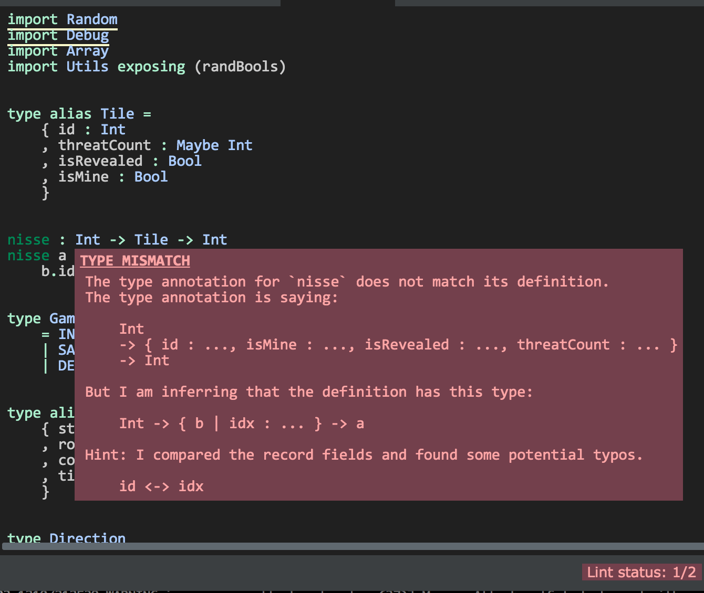
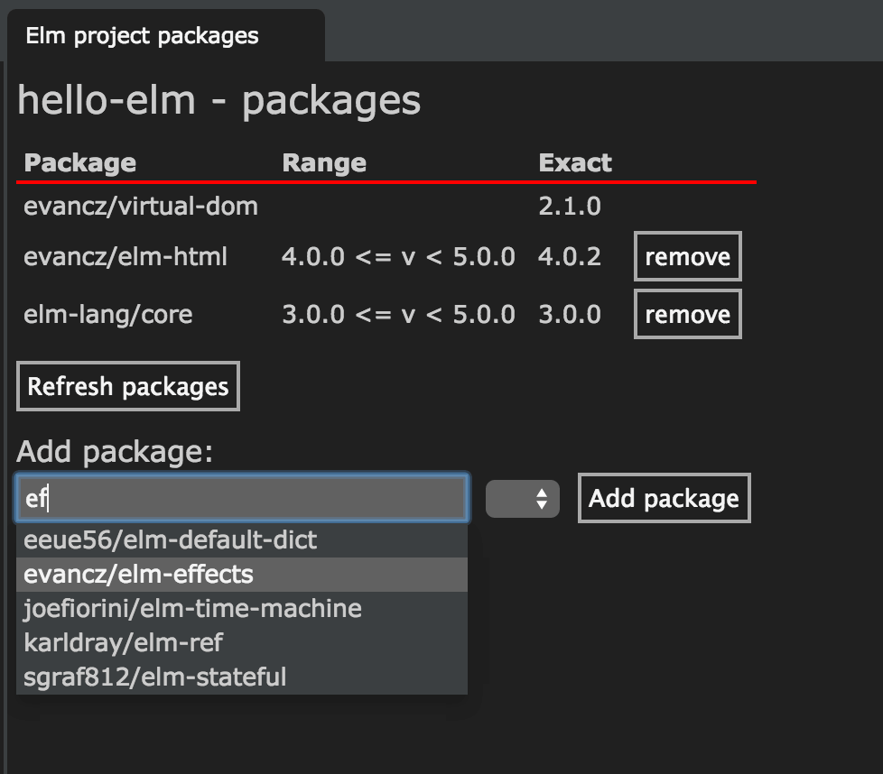
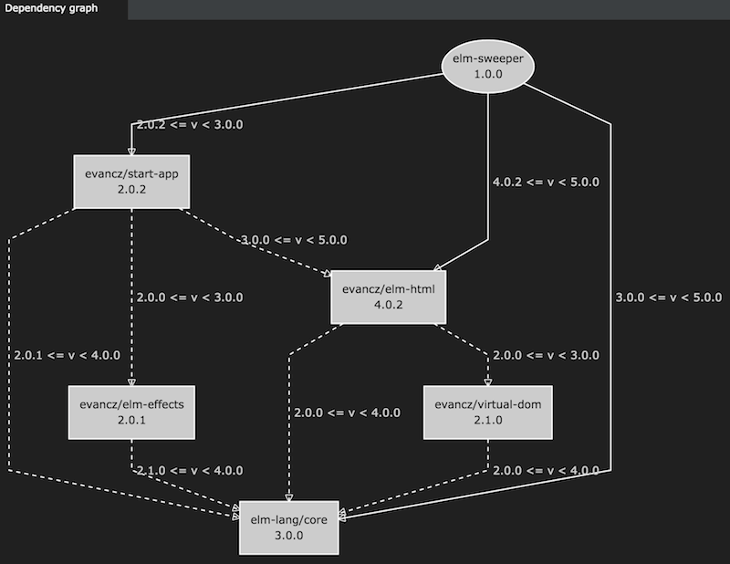
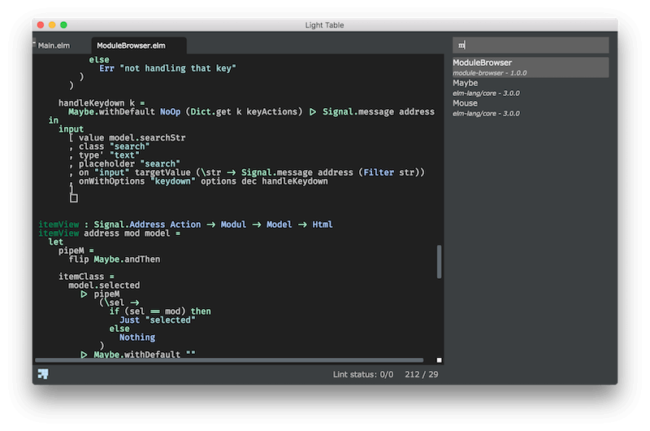
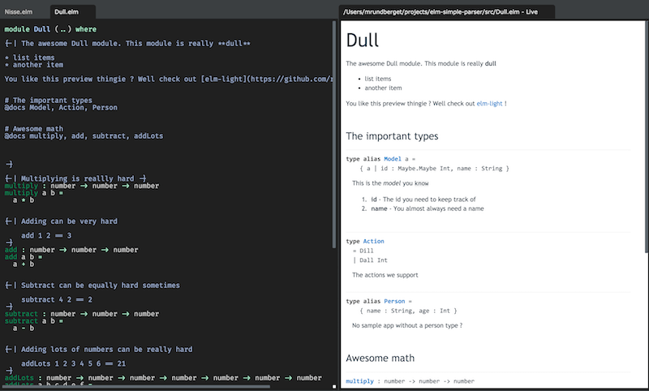

= Elm LightTable plugin
Elm language plugin for Light Table
v0.1.2, 2015-11-19: published
:library: Asciidoctor
:numbered:
:idprefix:
:toc: macro

http://elm-lang.org/[Elm] language plugin for Light Table

== Installation
Install using the Light Table plugin manager.
Alternatively you can clone it into `$LT_USER_HOME\plugins`.

== Preconditions
* **LIghtTable 0.8-alpha or higher is required**
* You will need to have the http://elm-lang.org/install[elm-platform] (there is also a npm installer out there)  installed and the following should be in your path:
** https://github.com/elm-lang/elm-reactor[elm-reactor]
** https://github.com/elm-lang/elm-make[elm-make]
** https://github.com/elm-lang/elm-package[elm-package]
** https://github.com/elm-lang/elm-repl[elm-repl]
* For all commands/features you will need to have a project folder with a `elm-package.json` file

NOTE: Tested with elm 0.16.0 on OS/X 10.9.5, Ubuntu 14.04 and Windows 10.

== Resources
* http://rundis.github.io/blog/2015/elm_light.html[ScreenCast] - Demo of the features available in the first release of the plugin
* http://elm-lang.org/[elm-lang.org] - The home of Elm
* https://github.com/LightTable/LightTable[Light Table] - GithHub home of Light Table

== Overview

=== Elm client
For pretty much any operation this plugin you support you need an elm client connection. An elm client connection
is a small node process that the plugin typically will spawn automatically for any action that requires a elm client.

.When the elm-client starts it;
. Opens an elm-repl
. Starts (and listens) to elm-reactor
. Listens for commands from light table (eval, docs, autocompletions etc)

.You may also manually connect to an elm project using the connect bar in Light Table
* Invoke the command: `Connect: Add Connection`
* Select **Elm** from the list of client types
* If all goes well you will get a confirmation in the status bar that the project is connected

.To disconnect
* Invoke the command `Connect: Show connect bar`
* Find the project in the list and click disconnect

The client connectionns is named after the the directory containing the elm-package.json

=== Elm project
In the future the plugin might add support for geting started with just a simple .elm file, but you very quickly
end up having to add some config especially a elm-package.json. So as mentioned in the preconditions, you will need one.

.How does elm-light determine the project ?

Say you have a project with the following structure

[source]
----
/home/myuser/projects/hello-elm/elm-package.json
/home/myuser/projects/hello-elm/hello.elm
/home/myuser/projects/hello-elm/src/util.elm
----

* If you start of with evaluating hello.elm, the plugin will start looking for a elm-package.json in the same directory
as the hello.elm file resides. So the elm client will use `/home/myuser/projects/hello-elm` as root path and the project assumed to be `hello-elm`
* If you start of with evaluating util.elm, it will start looking for a `elm-package.json` in the `src` folder, since not finding one it will try the parent directory (and recurse until one found or none can be found).
Hence the root path and project name will be the same
* If you (with the elm-client still running) later add a .elm file anywhere below `/home/myuser/projects/hello-elm`  and eval or lint (or whatever) on it, the plugin
will assume it belongs to the same elm-client and use that.

=== A few disclaimers/general notes
* If an operation takes some time to respond, it might be that it's because elm is installing packages (first time or you've changed the elm-package.json file)
* If stuff does't work and you don't get anything sensible indicating why not, it's worth trying to remove the folder elm-stuff and run `elm-package install`
at the command line to see if packages installs correctly (I've experienced that it's not always reliable...)

== Usage

=== Linting

To lint an elm file use the command: `Elm: Lint selected file`

* Errors are marked with red underline, warnings with yellow underline
* Errors/warnings in dependent files are shown in the console

==== Details and navigation
* To view details about an error or warning place your cursor inside an underline range and select the
command `Linter: Show details at cursor`
* To move to next lint result select command `Linter: Move to next result`
* To move to previous lint result select command `Linter: Move to previous result`

NOTE: Rember to save. Linting works on saved files !

----
TIP: Linting on save
If you wish to lint on save just add the following to your user behaviors

[:editor.elm :lt.objs.editor.file/on-save :elm.lint]
----

==== Quick fixes
For some warnings and errors there are shortcut operations to do fixes in your code.

.Currently these includes
- **Unused import**: Allows you to quickly remove an unused import
- **Missing type annotation**: Facility to add type annotation (top level expressions only)
- **Type mismatch**: Facility to fix a type annotation that doesn't match the implementation
- **Naming errors**: For some spelling errors the compiler will provide helpful suggestions. Feature to quickly apply one of those suggestions (if any)

NOTE: When an linter message is open and a quick fix operation is available you
will have buttons for each possible action. Pressing `Enter` will invoke the first action available (which is typically the one you want)

=== Make (to js)
To run make for your elm file/project use the command: `Elm: Make selected file`
A .js file is generated in the same directory as the .elm file resides.
Errors and warnings are handled similar to linting.

=== Testing
[cols="1a,1a"]
|===

| image::browsertests.png[width=400, role="thumb"]
| image::consoletests.png[width=400]
|===

.Preconditions
The plugin comes bundled with the https://github.com/rtfeldman/node-elm-test[node-elm-test] node package. It's slighly
modified to ensure that it uses the node instance that comes bundled with Light Table.
So you **don't** need to install node-elm-test !

Of course you can run browser based tests without problems. The great benefit of using the console runner is that these tests can also be run as part of a ci build.

==== Quick start
The plugin has a feature create a test skeleton subproject. From any (non-test) elm file;

. Invoke the command `Elm: Add test subproject to current project`
. The plugin will:
.. Create a test directory
.. Create a elm-package.json file based on the elm-package.json file in your current project. It will add dependencies
to https://github.com/deadfoxygrandpa/Elm-Test[elm-test] and https://github.com/laszlopandy/elm-console[elm-console].
It will also set up source directories for your test project to include any source directories set up for your root project
.. It will add a sample console TestRunner.elm and a sample Tests.elm
.. Finally it will run elm-package install do set you up for subsequently quickly run your tests (this may take a little while the first time)
. Now you have a great starting point to start writing tests running them

==== Running tests
. Open a test file
. Select the command `Elm: Test current file`
. One of two outcomes will occur:
.. If the test is considered a console test (contains "consoleRunner" or "Console") ; The tests are run using https://github.com/rtfeldman/node-elm-test[node-elm-test].
Results are shown in the console. In case of errors a message is displayed in the status bar
.. If not a console test, the test is assumed to be a browser/element test and the file is opened in the inline browser (backed by elm-reactor). Test are run and results are shown using elm-tests elementRunner (or stringRunner if that's what you are using)

NOTE: The first time you run a browser test, you might need to reload the page as the reactor might not have completed starting before
the tests  run (and hence the test file hasn't completed compiling yet). After that it's just a matter of changing tests and reloead (`ctrl-r`)

=== Language docs
.From an elm file;
* Select the command: Docs: Search language docs (ctrl-shift-d)
* Enter search criteria
* Behold the results

NOTE: Doc search currently picks a random elm file as the basis for search. And uses
https://github.com/ElmCast/elm-oracle[elm-oracle] behind the scenes. Elm oracle is bundled with the plugin btw.

=== Inline doc
* With the cursor over something docable press ctrl+d.
* Inline documentation is displayed (or an error message is shown on the status bar)
* Ctrl+d again to close the inline doc

NOTE: Only functions that are available through imports (explicit + elm defaults) are docable

=== Autocomplete (incubating)
Once an elm editor has a connection (through use of linting, make, inline doc etc)
the autocompleter kicks in (sort of (: ).

It should kick in when you type something (like Signa ... should show completions from Signal etc)

.To turn it off (and optionally turn on text hints) just edit your __User behaviors__
[source,clojure]
----
 [:editor.elm -:lt.plugins.elm-light/use-local-hints] ; Turn off the autocompleter
 [:editor.clj :lt.plugins.auto-complete/textual-hints] ; Enable textual hings again
----

=== Editor repl
Once connected to an elm-project in Light Table, a repl is started running in the background.
This means you can evaluate statements from within any given elm editor.

* In an elm file:
* Position the cursor within the region of a top level expression and press `cmd/ctrl+enter`.
* You may also select a region that constitutes of one or more top level statements and press `cmd/ctrl+enter`
** **However** results are shown next to the first line of the selection, even though the actual result might be the related to the
   last statement (or if an error, whatever line caused the error)
* results are shown inline

You may reset the repl to start with a clean slate. Just select the command: `Elm: Restart repl for current project`

NOTE: Results are currently only showed sensibly if you eval one top level statement at a time. Also the repl is shared
between all elm editors for a given project.

=== "Anonymous" repl
You may also create a repl that isn't backed by a file

* Select the command `Elm repl: Open a elm repl`
* You may now eval code as for an Editor repl

NOTE: You need a connected elm project for this to work

=== Elm-Reactor
When you connect an elm project, elm-reactor is started in the background.
To support multiple projects running in parallell each projects elm-reactor gets a port from the port-range (3000 - 4000)

Convenience commands has been added to view an elm file in the Light Table internal browser.

.Either
* Select the command `Elm: View current elm file in browser (elm-reactor)`
* or `Elm: `Elm: View current elm file in browser with debugger (elm-reactor)` if you wish the debugger panel opened by default

TIP: If you get a blank page (and/or an error in the console about the address not being available), it might be
because elm-reactor is running make in the background. You might need to be patient and refresh the browser (`cmd+r` for mac)

WARNING: On Mac the elm-reactor starts two processes. You may experience occurences when the plugin is unable
to terminate both these subprocesses appropriately for now. To be improved.
You may close connections by using the command `Connect: Show connect bar` and click disconnect for your elm project

=== Package management
The plugin has an interface for doing some handy package related task. It's basically a thin wrapper over
the elm-package command with a UI to give you a better overview.

==== Open package manager
From an editor with any file under your project, select the command `Elm: Show project packages`

NOTE: You need to have a working network connection, as it retrieves package info from the central elm package repository

==== Add a new package
* Search for a given package in the section for adding packages
* Use up/down arrows to navigate the dropdown
* Use enter to select the package you wish to add
* Select the version of the package you wish to install
* Click `Add package`
* Check the status bar/console log for feedback on progress and success/failure
* If all goes well the view of packages gets updated (as will you elm-package.json file in the background as well)

NOTE: The feedback from elm-package install is not always the most helpful when there are problems. Sometimes
it even reports success when nothing has been done. Check out the github repo for elm-package for follow up on issues
related to this. Be adviced that when a package is listed with the `exact` column empty, means something didn't go well
, eventhough elm-package might have reported success.

==== Remove package
You can remove packages that are specified in your elm-package.json.

* Click on the `remove` button
next to the package in the listing.
* Your elm-package.json file will get updated
* elm-package install invoked to clean up
* The listing will be updated (with potential transitive deps removed too)

==== Handling other cases
Sometimes you need to edit your `elm-package.json` file directly for elm-package to know what to do.
There might also be the case you have defined a `elm-package.json` but haven't yet invoked any elm command
that resulted in package install. For such cases the `Refresh packages` button comes in handy !

==== Package docs
For any packages installed (with an exact version) you may view the online docs:

* In the list click on the package name
* A LT browser tab is opened (or focused if one already exists) and the package doc for the selected package
is displayed

=== Dependency graph

You may view an inline dependency graph of you project dependencie.

.Either
* From any file under your project root invoke the command `Elm: Show dependency graph`
* Alternatively click the `Show dependency graph` button from the package viewer

.Additional info
* Dashed arrows reprensents transitive dependencies
* If you hover of a dependency you will see a short package summary
* Dependencies found in elm-package.json that `elm-package` failed to install will
be shown with a red color
* When you update packages in the package viewer, the graph is automatically refreshed

NOTE: You will need an internet connection for this to work (uses package.elm.lang.org)

=== Elm format
In an effort to standardize how Elm code should be formatted, https://github.com/avh4/elm-format[elm-format] was
created. It is still in alpha, but I figured you might just as well start playing with it.

.Precondition
You will need to install elm-format and make sure the executable is available in your path for it to work from
the plugin. You'll find install instructions on the https://github.com/avh4/elm-format[elm-format] readme.

.Format editor contents
* With an elm file open, select the command `Elm: Format editor contents`
* If no errors the whole editor is formatted (but any format changes aren't saved)
* If there are any errors (typically syntax errors), a message is shown in the Statusbar and details can be found in the console

.Format top level expression
If for some reason you find yourself wanting to just format a top level expression, this is the command for you.

* Place the cursor somewhere within the top level expression you wish to format
* Select the command `Elm: Format top level expression at point`

.Format a file
* With an elm file open, select the command `Elm: Format file`

WARNING: Any unsaved changes will be lost when running this command. This command updates the file backing the editor
in question.

.Adding keyboard shortcuts
[source,clojure]
----

 [:editor.elm.common "cmd-shift-l" :elm-format-expression]
 [:editor.elm.common "cmd-ctrl-l"  :elm-format-buffer]
----

.Configuring indent in Light Table
[source,clojure]
----
[:editor.elm.common :lt.objs.editor/tab-settings false 4 4] ;; or 2 2 if the war continues and things change back
----

----
TIP: Format and Lint on save
If you wish to format and lint on every save just add the following to your user keymap

[:editor.elm "ctrl-s" :save :elm-format :elm.lint]

However if you added linting when saving to your user behaviors, you would want to remove that otherwise you'll be double linting !
----

=== Module browser

.To view your project modules:
* From an open elm editor
* Select the command : **Elm: Show module-browser**
* Use the arrow keys to move the selection up or down
* The list of modules is filtered by "starts-with" (case insensitive) from what you enter in the input text field
* To open a module press `Enter`
* To close the module browser, press `Esc`

NOTE: You need to have run elm-make/elm-package install to view modules from 3.rd party packages.

=== Preview package docs for module

If you are writing a package to be deployed to http://package.elm-lang.org/ you need to document
all your exposed modules (remember to add any modules for public usage to the `exposed-modules` entry in your elm-package.json)

.You can preview the docs in Light Table
* From an open elm editor (an exposed module remember)
* Select the command : **Elm: Preview doc for selected file**
* A preview window is opened (you might want to move that to it's own tabset)
* Write docs according to the instructions at http://package.elm-lang.org/help/documentation-format
* When you save your file the preview will be automatically updated

WARNING: The doc preview only works for exposed modules

=== Note on editor commands

==== Select top-level statements
If you wish to select a top level statement just invoke the command `Elm: Select top level expression from current expression`

NOTE: The selection algorithm is sort of naive, so there might be cases when the selection doesn't work out quite as you'd hope.
In most cases it should work sensibly though.

.To enable as keyboard shortcut in both elm editors and anonymous elm repl
[source,clojure]
----
  [:editor.elm.common "alt-shift-s" :elm.select.top.level] ; modify keybinding to your liking !
----

== Contributing
Pull requests are most welcome. Please do not include the transpiled files (*_compiled*) in the PR.

== History
* 0.3.7 Improved autocompleter implementation and added quick-fixes feature to Linter messages
* 0.3.6 Added package doc preview feature
** Fixed bug with lint display at bottom of editor getting cut off
* 0.3.5 Added module browser
** Bugfix: Display make errors (both make and linting)
* 0.3.4 Updated to supprt elm-format 0.2-alpha
** Added format buffer (keeps unsaved changes) and format expression commands
* 0.3.3 Fix compatibility with LT 0.8.1. Also tweaked the autocompletion to be a little faster and more accurate.
* 0.3.2 Module aware autocomplete and remove leading pipes from repl results
* 0.3.1 Added an inline project dependency graph (using d3)
* 0.3.0 Added windows support. See github release notes for details
* 0.2.0 Improved linting, introduced test support and support for elm-format
* 0.1.3 Bugfix: Forgot to include react.js (used for rendering package ui)
* 0.1.2 Package manager and 0.16.0 fix
** UI for managing your project packages.
** 0.16.0 fix: Remove ansi color codes from errors and warnings shown inline
* 0.1.1 Maintenance release:
** Feature to select top level expressions
** Eval in repl with no selection automatically selects top level expression based on cursor position
** Syntax highlight multiline strings `"""`
** Allow user to select to browse file in reactor with or without debugger
** Fix: Allow reuse of released reactor ports
** Add tag :editor.elm.common to allow users to configure common behaviors/commands for repl and editors more easily
* 0.1.0 Initial release

== License
MIT, same as Light Table. See LICENSE.md for details.

